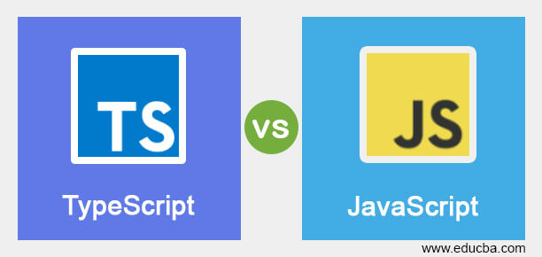

# Curso de fundamentos de Typescript

Typescript es un superset de JavaScript que agrega caracteristicas de tipado estático, clases, interfaces y otros conceptos de la Programación Orientada a Objetos (POO).

## ¿Por qué usar typescript?

1. Detecta errores en una fase temprana: A medida que se va escribiendo el código se va analizando y TS va a proporcionar un reporte con errores o mejoras que se pueden realizar.

2. Amplia la funcionalidad de javascript: TS permite utilizar funciones y conceptos de programación avanzados de manera sencilla, como clases, interfaces, enumeraciones, entre otros.

3. Proporciona una mejor experiencia de desarrollo para grandes proyectos: TS es especialmente util para proyectos grandes con muchos desarrolladores, ya que puede ayudar a mantener el código organizado y facil de entender.

   Veamos algunos datos que respaldan el uso de TS:

   - [Estaditica de descargas de TS en npm Trends](https://npmtrends.com/typescript)

   - [Top 10 de los lenguages mas usados según Github](https://octoverse.github.com/2022/top-programming-languages)

   - [Amor y odion hacia TS según stackOverflow](https://survey.stackoverflow.co/2022/#most-loved-dreaded-and-wanted-language-love-dread)

   Según un [estudio realizado por Airbnb](https://earlbarr.com/publications/typestudy.pdf) lograron prevenir en un 38% la generación de bugs gracias al uso de Typescript.

4. Integración con librerías y frameworks: Typescript es compatible con muchas librerías y frameworks de JavaScript, lo que puede facilitar la integración de estas en tus proyectos.

   

## Herramientas necesarias para continuar con el curso

- [Nodejs](https://nodejs.org/es): Se recomienda usar la versión LTS mas reciente. En caso de usar WSL, una distribución de Linux o Mac se recomienda instalar [NVM](https://github.com/nvm-sh/nvm) y descargar la versión LTS mas reciente.

- Editor de código: Se puedes usar el editor de código de tu preferencia pero se recomienda usar [visual studio code](https://code.visualstudio.com/)

- Navegador: Se puede usar cualquier navegador que soporte TS pero se recomienda [chrome](https://www.google.com/intl/es-419/chrome/)

## JavaScript vs Typescript



Veamos que cosas de deben tener en cuenta del ecosistema de JavaScript para trabajar con Typescript.

**¿Typescript es diferente de JavaScript? o un ¿Desarrollador de Typescript es diferente a un desarrollador de JavaScript?**

Lo primero que se debe tener en cuenta es que JavaScript ha tenido un uso y mejora incremental a través del tiempo, ya que no solamente se puede usar para el desarrollo Front-end y Back-end sino que tambien nos permite construir aplicaciones móviles, videojuegos, Automatización de Tareas, extensiones y complementos del navegador, Internet de las Cosas (IoT), Machine Learning, etc. En otras palabras JavaScript ha sido un lenguaje que ha madurado a traves del tiempo.

Sin embargo hasta ahora existe una desventaja al momento de usar JavaScript y es que solamente se detectan los errores cuando el código se ejecuta. Aquí es donde se destaca la principal ventaja de usar TypeScript ya que este nos proporciona un **análisis de código estático** que nos ayuda a prevenir errores antes de ejecutar el código.

También se debe tener en cuenta que mientras evoluciona JavaScript, Typescript irá a la par adoptando las nuevas características.


¿Qué es el análisis de código estático?

What I learned from Software Engineering at Google [Articulo recomendado](https://swizec.com/blog/what-i-learned-from-software-engineering-at-google/)

Según el libro **Software Engineering at Google** señalan ciertas capas para detectar errores en el desarrollo de software.

1. Análisis de código estático: Es una técnica de análisis de software que se realiza en el código fuente sin ejecutar el programa. El objetivo del análisis de código estático es identificar defectos y vulnerabilidades de seguridad en el código antes de su ejecución o implementación.

2. Pruebas Unitarias (Unit Tests): Técnica que consiste en escribir codigo automatizado encargado de validar el funcionamiento de los elementos que componen la aplicación.

3. Pruebas de Integración (Integration Tests): Técnica que consiste en probar el funcionamiento de manera colectiva de los diferentes elementos que componen la aplicación.

4. Revisión de código (Code Review): Se verifica si se ha seguido con las normas, estándares y mejores prácticas establecidas por el equipo.

En conclusión se puede decir que Typescript es diferente de JavaScript y por ende un desarrollador de Typescript también sera diferente a un desarrollador de JavaScript.

## Configuración del proyecto

1. Lo primero que debemos verificar es que tengamos instalado git, para ello usamos el siguiente comando dentro de cualquier terminal:

   ```txt
   git --version
   ```

   En caso de tener una respuesta como la siguiente significa que tenemos instalado git:

   ```txt
   git version 2.25.1
   ```

   En caso contrario, debemos instalarlo:

   - Windows sin WSL: Descargar git desde la siguiente [página](https://git-scm.com/) e instalar de forma tipica.

   - Windows con WSL, linux o Mac: Ejecutar el siguiente comando dentro de cualquier terminal:

     ```txt
     sudo apt-get install git
     ```

   Para verificar que todo quedo instalado correctamente ejecutamos el comando para verificar la versión.

2. A continuación vamos a crear la carpeta del proyecto, se recomienda crearla con el nombre "Typescript-Fundamentos" y que este ubicada en el lugar de tu preferencia.

3. Dentro de la carpeta del proyecto vamos a crear las siguientes carpetas y archivos:

   - scr (folder): Va a conteneder todo los archivos de nuestro proyectos.

   - .gitignore (file): Nos va a servir para ignorar los archivos que no queremos respaldar. Podemos crearlo accediendo a la siguiente página [gitignore.io](https://www.toptal.com/developers/gitignore). Escribimos los siguientes terminos: windows, mac, linux, node y le damos generar para obtener nuestro gitignore.

   - .editorconfig (file): Este archivo nos va a sevir para establecer unas reglas generales en el editor que tambien van a servir para que los demas miembros del equipo puedan trabajar de manera similar. El archivo va a tener el siguiente contenido:

     ```txt
       # Editor configuration, see https://editorconfig.org
       root = true

       [*]
       charset = utf-8
       indent_style = space
       indent_size = 2
       insert_final_newline = true
       trim_trailing_whitespace = true

       [*.ts]
       quote_type = single

       [*.md]
       max_line_length = off
       trim_trailing_whitespace = false
     ```

   - Package.json (file): Inicilizamos el proyecto de node usando el siguiente comando:

     ```txt
       npm init -y
     ```

     De esta manera tendremos creado el archivo package.json.

4. Instalamos TypeScript por medio del siguiente comando:

   ```txt
     npm install typescript --save-dev
   ```

   De esta manera estamos instalando Typescript a nivel de proyecto. Para verificar la versión que quedo instalada usamos el comando:

   ```txt
   npx tsc --version
   ```
